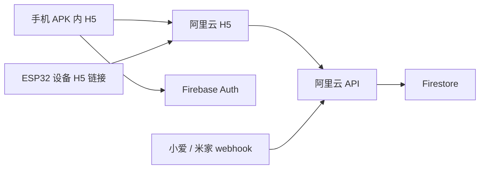

# 系统架构

## 组件

- H5 App：任务管理、成员管理、设备绑定、今日任务、完成操作；手机端包装成 APK。
- Firebase Auth：用户登录。
- Firestore：家庭、成员、任务、完成记录、设备信息。
- Cloud Functions 或阿里云 API：计算今日任务、设备绑定、设备短期 token、语音 webhook。
- ESP32-S3-Touch-LCD-4.3：固定屏幕，通过 Wi-Fi 访问专用设备 H5 链接，展示今日任务，触摸完成。
- 阿里云：自有域名、H5 静态资源、HTTPS API、Webhook、定时提醒服务。

## 推荐数据流



## H5 路由建议

- `/app`: 手机端主应用，包装成 APK 后加载此入口。
- `/device/:deviceId`: ESP 固定屏入口，只展示今日任务和完成操作。
- `/pair/:code`: 手机端设备绑定入口。
- `/api/*`: 后端 API。

当前生产域名：

- 手机入口：`https://lifetodo.xyz/app/`
- 设备入口：`https://lifetodo.xyz/device/?home=demo-home&device=entry`
- 后端入口：`https://lifetodo.xyz/api/`

## 设备绑定

1. 设备首次启动进入配网模式。
2. 用户给设备配置家庭 Wi-Fi。
3. 设备打开或显示设备绑定链接，请求一次性绑定码。
4. 手机 App 扫码或输入绑定码。
5. 服务端把 `deviceId` 绑定到 `homeId`，签发设备页面访问 token。
6. 设备后续访问 `/device/:deviceId?token=...`，由 H5 页面拉取今日任务和提交完成事件。

## 今日任务计算

服务端提供：

- `GET /device/{deviceId}`
- `GET /device/today?deviceId=...`
- `POST /device/tasks/{taskId}/complete`
- `POST /app/tasks/{taskId}/complete`

返回给设备的数据应尽量扁平：

```json
{
  "date": "2026-06-30",
  "homeName": "家",
  "members": [
    {
      "id": "m1",
      "name": "妈妈",
      "tasks": [
        {
          "id": "t1",
          "title": "铲猫砂盆",
          "done": false,
          "accent": "#ffb35c"
        }
      ]
    }
  ]
}
```

## 为什么设备访问阿里云 H5/API

Firebase 客户端 SDK 对 ESP32 不友好，认证和实时同步成本较高。让设备只访问自有域名下的 H5 页面和 HTTPS API，可以隐藏 Firebase 凭据、简化 token、降低固件复杂度，也方便以后接入米家/小爱。
